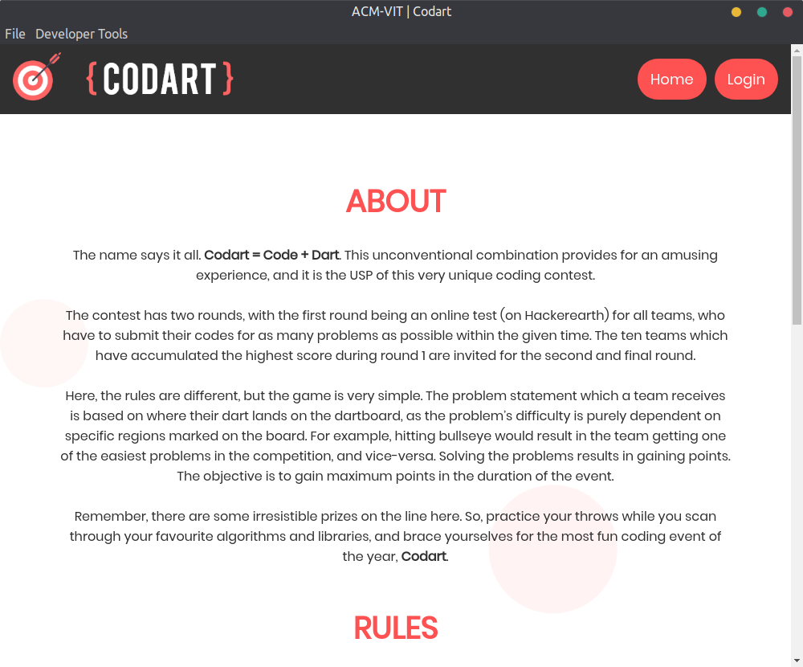
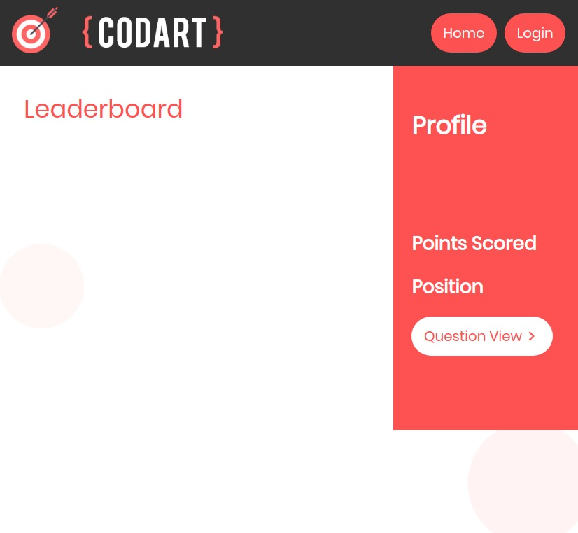
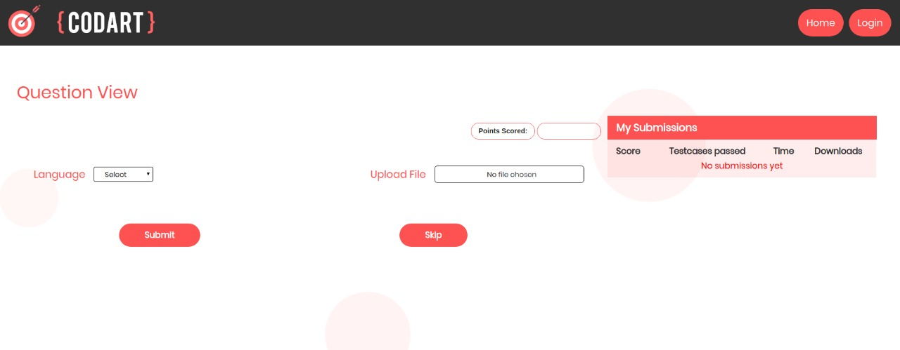

# Electron Client for ACM-VIT Codart'19
Codart is ACM-VIT's annual flagship Competitive Coding event, where participants are assigned questions on the basis of the score of dart game.
<blockquote>
The submissions are uploaded and the results are shown on our client application, along with leaderboard, etc. similar to any other online judge platform.
</blockquote>

## Application Screenshots

  
	

  

## Steps to run application
- Step 1: Fork the repository and clone it to your machine
- Step 2: Change directory to the local clone using `cd codart`
- Step 3: Install all the dependencies using `npm install`
- Step 4: To view the application on your computer, run `npm start`
- Step 5: Build the desktop application using `npm run package-{linux/mac/win}` depending on your OS. 
Note: This step might take upto 30-60 mins, depending on your system
- Step 6: Your application files will get created in `/dist` folder

## Contributors
- Frontend: [Aditya Srivastava](https://github.com/adityasrivast)
- Backend: [Shubham Awasthi](https://github.com/awasthishubh)
